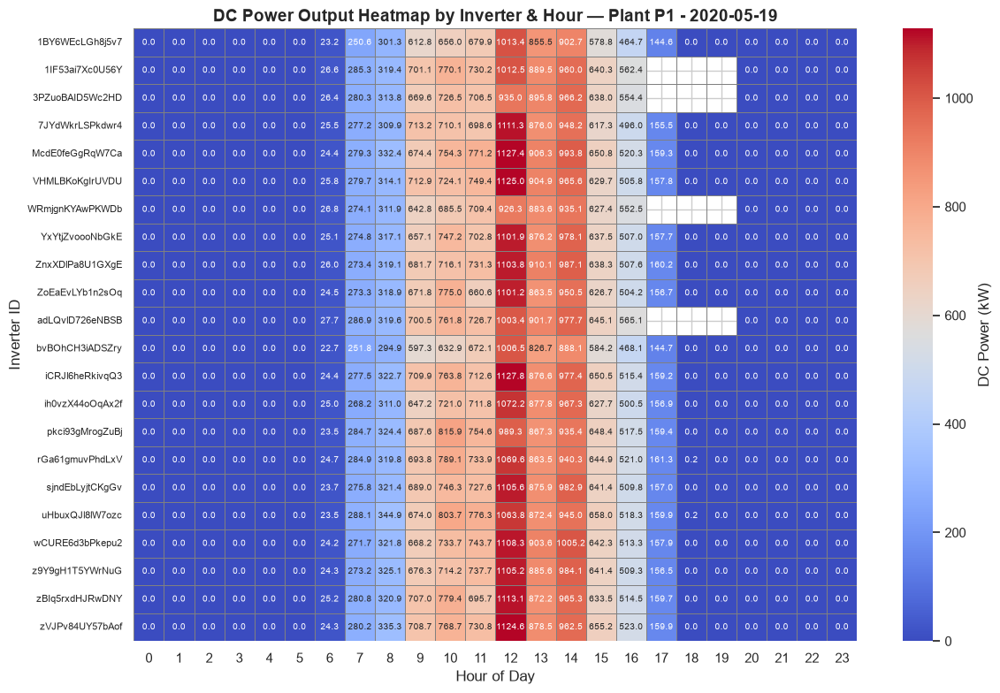
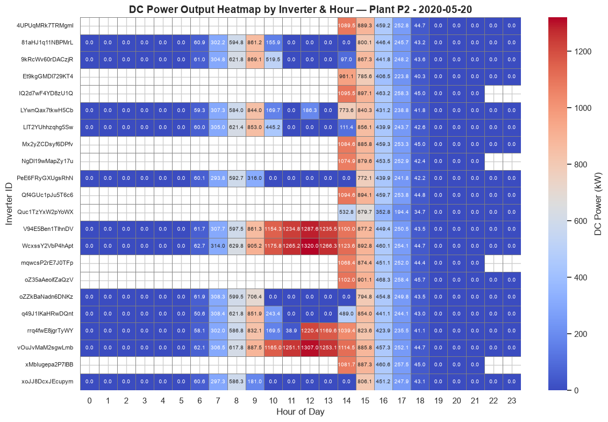
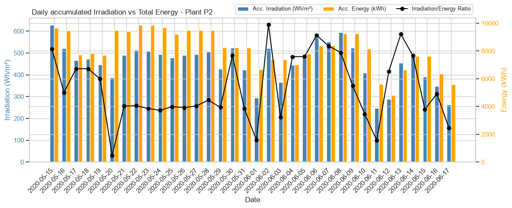
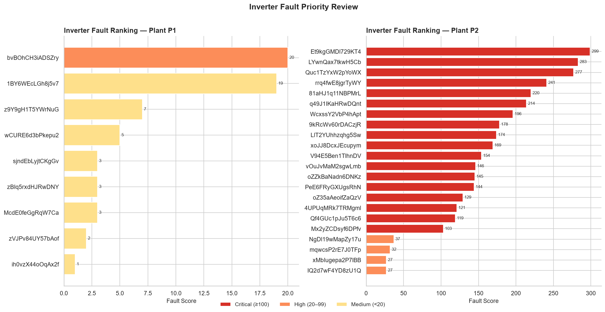

# Solar Power Plant — Data Quality & Fault Analysis

## EXECUTIVE SUMMARY

The data quality analysis reveals that the solar plant datasets present completeness issues in their time series records, with the problems being more severe in Plant 1 than in Plant 2. Although all datasets cover the same time period, there are missing time intervals that affect the regularity of the measurements.

---

## DATA STRUCTURE

### Analyzed Datasets
- **Planta1_Generacion.csv**: Inverter power generation data
- **Planta2_Generacion.csv**: Inverter power generation data
- **Planta1_Sensores.csv**: Meteorological and environmental data
- **Planta2_Sensores.csv**: Meteorological and environmental data

### Coverage Period
- **Plants:** P1 · P2
- **Inverters per plant:** 22
- **Start date**: 15/05/2020
- **End date**: 17/06/2020
- **Total duration**: 34 days
- **Expected frequency**: Measurements every 15 minutes (96 records/day)

---

## Insight 1 — DC Power Scale Mismatch in Plant 1
Plant 1 DC power readings are approximately **10× higher** than Plant 2 values for equivalent conditions. This is likely a **unit error introduced during data collection** rather than a real difference in generation capacity, and should be corrected before any cross-plant comparison.

---

## Insight 2 — Irregular Time Series Intervals
Both the generation and sensor datasets present **missing 15-minute interval records** across the full observation period. This affects the reliability of any time-based aggregation and should be addressed with interpolation or explicit gap-flagging before modelling.

---

## Insight 3 — Inverter Record Gaps Detected in Plant 2 (Preliminary)
During initial data exploration, **4 inverters in Plant 2** showed a notable number of missing records. This was flagged for deeper investigation in the EDA phase — see Insight 7 for the full breakdown.

---

## Insight 4 — Partial and Full Irradiation Data Gaps
Comparative analysis of irradiation capture metrics revealed missing data in both plants:

*DC power output by inverter and hour — Plant 1 (2020-05-19). Contrast with Plant 2 shows isolated vs systemic faults.*

*DC power output by inverter and hour — Plant 2 (2020-05-20). Multiple inverters show critical measurement gaps.*

- **Plant 1:** Partial gaps on 2020-05-16, 2020-05-20, 2020-05-21, 2020-05-28, and 2020-05-29.
- **Plant 2:** Partial gaps on 2020-05-20 and 2020-05-29. Complete absence of irradiation data from **2020-05-21 to 2020-05-28**.

DC power generation was recorded during these periods, which points to **irradiation sensor failure** rather than a plant shutdown.

---

## Insight 5 — Irradiation Sensor Faults Confirmed
The coexistence of degraded irradiation readings alongside normal DC energy generation confirms the faults originate in the **irradiation measurement equipment**, not in the panels or inverters.

*Daily accumulated irradiation, energy output and ratio — Plant 2. Gray dashed line marks expected healthy ratio (6.35).*

Severity was assessed using the daily irradiation/energy ra tio (baseline ≈ 0.065 for a correctly calibrated sensor):

| Condition | Ratio range |
|---|---|
| Normal | > 0.061 |
| Minor fault | 0.059 – 0.061 |
| Severe fault | < 0.059 |

**Key findings across the 34-day period (31 days with anomalies detected):**

- **23 days classified as severe fault (ratio < 0.059)**, affecting both plants. The worst values were recorded on 2020-05-20 P2 (0.0406), 2020-06-11 P2 (0.0441), and 2020-05-20 P1 (0.0441).
- **8 days classified as minor fault (0.059–0.061):** June 11 P1, June 12 both plants, June 3 P1, May 18 both plants, May 17 P2, June 17 P1.
- **Plant 2 is significantly more affected**, with 6 severe-fault days exclusive to P2 concentrated in late May and early June (May 21–29, June 1, 3, 10, 11, 15–17).
- **Plant 1** shows a more contained pattern, with severe faults mainly on May 19–20 and isolated days in June.
- No single day across the full 34-day window reached a normal ratio in either plant, pointing to a **persistent and systemic sensor degradation** rather than isolated failures.

---

## Insight 6 — DC/AC Power Measurement Faults in Inverters
Several days show DC power readings that are **decorrelated from energy output**, indicating measurement failures in the inverters rather than actual disconnections (energy generation continued normally).

- **Plant 1:** Measurement faults in 4 specific inverters on May 19. Complete loss of DC readings across all inverters between 14:00–16:00 on May 20.
- **Plant 2:** Multiple faults across different days, varying in both duration and number of simultaneous inverters affected. Most impacted days: May 20 and 27, June 10, 12, and 15.

---

## Insight 7 — Inverter Fault Ranking & Priority Review List

### Methodology
Two fault types were detected and scored independently:
- **Record absence:** inverter with <50% of the median daily records during solar hours (06:00–20:00) → weighted ×5 in final score.
- **Anomalous zero-power readings:** inverter power <5% of the hourly median while the plant median exceeded 100 kW.

`score = anomalous_hours + (absence_days × 5)`

---

### Plant 1 & 2 — Inverter Ranking

*Inverter fault priority ranking based on anomalous hours and absence days.*

> Plant 1 shows **isolated and low-severity faults**. Only 2 inverters require urgent attention.
> Plant 2 presents a **critical situation**: 17 out of 22 inverters show high-severity anomalies persisting across most of the 34-day period. Top inverters (`Et9kgGMDl729KT4`, `LYwnQax7tkwH5Cb`, `Quc1TzYxW2pYoWX`) recorded anomalous readings on **24–28 out of 34 days**. The scale and consistency of these faults suggests a **systemic measurement infrastructure problem** beyond individual inverter failures.

---

## Summary

| | Plant 1 | Plant 2 |
|---|---|---|
| Irradiation sensor status | 🔴 Severe/minor fault (all 34 days) | 🔴 Severe fault dominant (23 days) |
| Inverters with critical faults | 2 / 22 | 17 / 22 |
| Inverters with absence events | 0 / 22 | 8 / 22 |
| Most critical inverter | `bvBOhCH3iADSZry` (score 20) | `Et9kgGMDl729KT4` (score 299) |
| Fault pattern | Isolated, low severity | Systemic, high severity |
