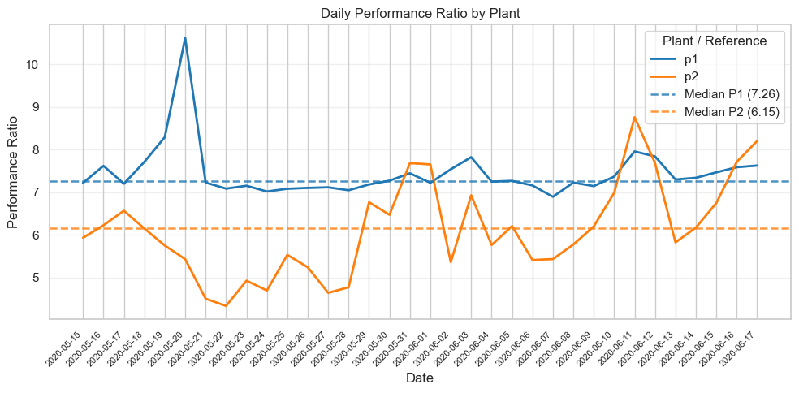
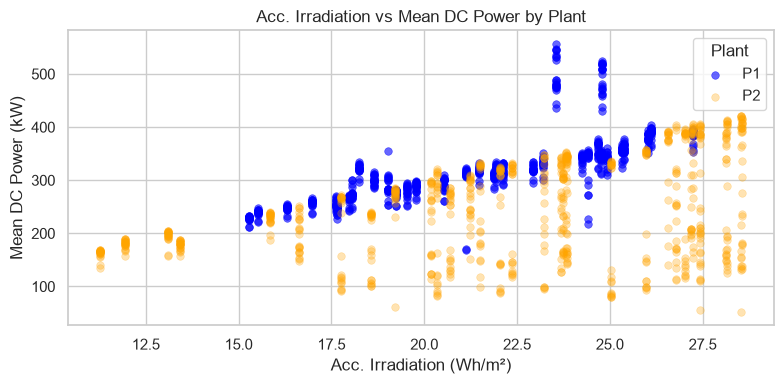
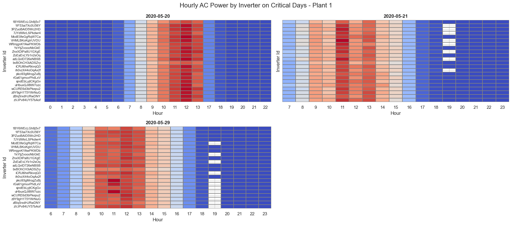
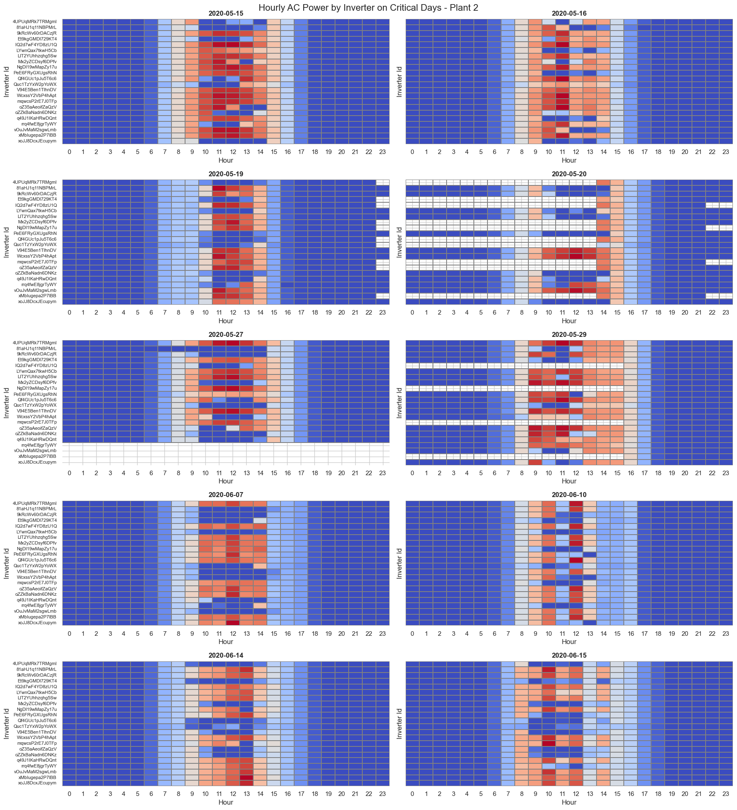
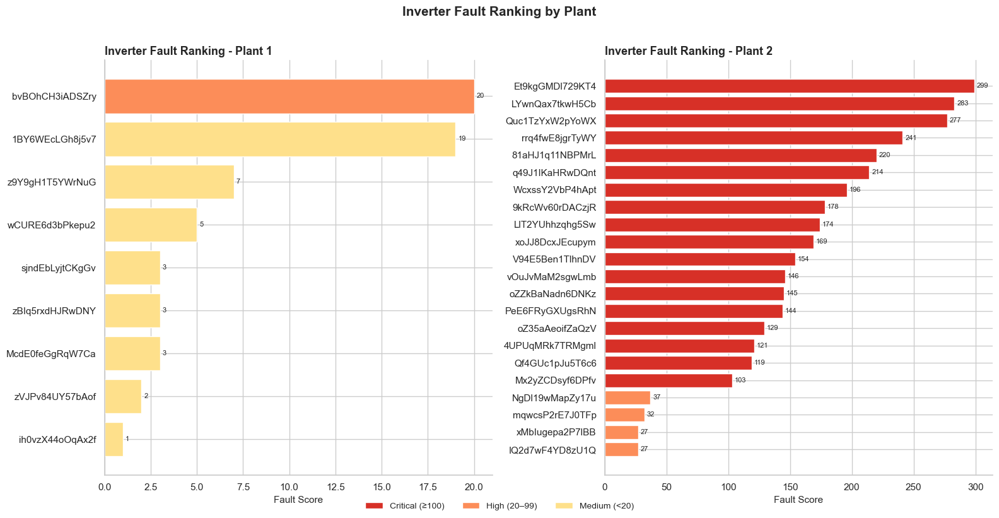

# Solar PV Data Quality Analysis and Fault Detection

## Project overview
This project explores the operational data of two utility-scale solar power plants with the objective of reviewing data quality and identifying potential measurement anomalies.

The analysis follows a structured workflow, starting with data validation and exploratory analysis before progressively investigating sensor faults, inverter measurement issues and potential mismatches.

Although the dataset is publicly available, the complete analysis methodology, feature engineering, anomaly detection criteria and business conclusions were developed independently as part of this portfolio project.


## Business Context
Reliable operational data is essential for monitoring the performance of photovoltaic plants. Missing records, sensor failures or incorrect measurements can lead to inaccurate production estimates, delayed maintenance actions and unaccurate forecasting models.

For this reason, validating data quality is often the first step before a performance analysis, predictive maintenance or energy forecasting.


## Project Objectives
The main objectives of this analysis are:

- Review the overall quality of the available datasets.
- Identify missing records and temporal inconsistencies.
- Detect potential irradiation sensor failures.
- Detect inverter measurement anomalies.
- Prioritize the most critical inverter fault days that would require further inspection.
- Produce a technical report summarizing the main findings.

## Dataset description

### Analyzed Datasets
- Planta1_Generacion.csv: Inverter power generation data.
- Planta2_Generacion.csv: Inverter power generation data.
- Planta1_Sensores.csv: Meteorological and environmental data.
- Planta2_Sensores.csv: Meteorological and environmental data.

### Coverage Period
- Plants: P1, P2.
- Inverters per plant: 22.
- Start date: 15/05/2020.
- End date: 17/06/2020.
- Total duration: 34 days.
- Expected frequency: Measurements every 15 minutes (96 records/day).

## Repository Structure
```text
data/
├── raw/
├── processed/
notebooks/
reports/
├── graphics/
README.md
requirements.txt
```

## Methodology

The project followed a progressive investigation workflow, where each finding guided the next stage of the analysis.

1. Dataset validation.
2. Time series validation.
3. Feature engineering and creation of analysis datasets.
4. Exploratory Data Analysis (EDA).
5. Anomaly detection and fault classification.
6. Inverter fault prioritisation.
7. Business interpretation and recommendations.

**Techniques used:** EDA, time-series analysis, feature engineering, correlation analysis (Pearson & Spearman), robust statistics (median & IQR), anomaly detection and fault ranking.

## Assumptions & Limitations
Several assumptions were made during the analysis due to the limited contextual information available with the datasets.

- No maintenance logs were available to validate whether anomalies corresponded to actual equipment failures or scheduled shutdowns.
- The installed capacity of each plant was unknown.
- External meteorological data was not available for validation.
- Detected anomalies should therefore be interpreted as potential measurement issues rather than confirmed hardware failures.

## Dataset Validation
Before starting the exploratory analysis, the raw datasets were reviewed to identify inconsistencies that could affect the results.

### Confirmed Data Issues
#### Plant 1 DC Power Scale Mismatch
Plant 1 DC power values in `Planta1_Generacion.csv` were consistently **10× higher than expected** under equivalent operating conditions. Cross-validation against AC power and Plant 2 confirmed a decimal scale error. All Plant 1 DC power values were divided by 10 before the analysis.

#### Irregular Time Series Intervals
Both the generation and weather sensor datasets contain missing 15-minute timestamp records throughout the observation period. These gaps include missing inverter measurements, **particularly affecting four inverters in Plant 2**. To preserve the integrity of the original data, no interpolation was applied; instead, the missing intervals were retained and explicitly considered during the analysis. The impact of these gaps on individual inverters is examined later in the EDA phase.

### Assumptions Adopted
#### Irradiation Variable
The variable `irradiacion_wh_m2` from `Planta1_Sensores.csv` and `Planta2_Sensores.csv`shows values that are inconsistent with typical solar irradiation expressed in KWh/m². As no documentation about the sensor units was available, the variable was kept unchanged and treated as a relative irradiation indicator throughout the analysis. Consequently, irradiation analyses focus on temporal consistency and anomaly detection rather than absolute physical values.

## Exploratory Data Analysis Findings
Each insight presented below builds upon the previous one, following the same investigation process that would typically be carried out during a real exploratory data analysis project.

### Insight 1 - Weak Relationship Between Abnormal Performance Ratio and Missing Irradiation Records

Some days showed unusually high **Performance Ratio (PR)** values. Since PR is calculated using the measured solar irradiation, missing irradiation records could artificially increase the ratio by underestimating the denominator.

- **Performance Ratio =** Acc. Daily Energy / Acc. Daily Solar Irradiation

  
*Daily Performance Ratio by plant. Several days present unusually high PR values that could potentially be related to missing irradiation records.*

To verify this hypothesis, the relationship between the **number of missing atmospheric records** and the **daily Performance Ratio** was evaluated independently for each plant using both **Pearson** (linear correlation) and **Spearman** (rank correlation) coefficients.

| Plant | Pearson r | Pearson p-value | Spearman ρ | Spearman p-value | N |
|:-----:|----------:|----------------:|-----------:|-----------------:|--:|
| P1 | 0.321 | 0.064 | 0.209 | 0.237 | 34 |
| P2 | 0.181 | 0.306 | 0.207 | 0.239 | 34 |

The results indicate:

- A weak positive correlation between the number of missing irradiation records and the daily Performance Ratio in both plants.
- None of the correlations are statistically significant (**p > 0.05**).
- Therefore, there is **no sufficient statistical evidence** to conclude that missing irradiation records systematically affect the daily Performance Ratio in this dataset.
- Overall, the correlation coefficients are low and suggest a weak or negligible relationship.

Although some abnormal PR peaks coincide with days containing missing irradiation data, the statistical analysis indicates that these events alone do not explain the observed variability in Performance Ratio.

### Insight 2 - Severe Irradiation and DC Power Mismatch in Plant 2

The comparison between irradiation and DC Power revealed a clear mismatch in Plant 2. Plant 1 also shows some mismatches, although they are much more localized and mainly occur during periods of high irradiation.

  
*Irradiation compared with DC Power in both plants. Plant 2 shows a severe mismatch, while Plant 1 presents only localized deviations.*

In Plant 2, similar irradiation levels often correspond to very different DC Power values, suggesting that the recorded power does not always follow the expected production pattern.

To determine whether the problem was related to inverter conversion, DC and AC Power were compared during these anomalous periods.

---

### Insight 3 - DC/AC Power Conversion Faults Discarded

DC and AC Power remain almost perfectly correlated, even during the anomalous periods detected previously.

The analysis was filtered using:

- **Irradiation threshold:** >16 Wh/m2
- **DC Power threshold:** <180 kW

Results:

- **Pearson correlation:** 1.000
- **Spearman correlation:** 1.000

This rules out faults in the DC-to-AC conversion process. The anomalies therefore originate before or during the measurement stage rather than during power transformation.

The next step was to analyze inverter behaviour at hourly resolution.

---

### Insight 4 - Different Inverter Anomalies detected at Hourly Level in Critical Days

A detailed review of representative critical days revealed different types of inverter anomalies.


*Hourly AC Power recorded by inverter during representative critical days in Plant 1.*


*Hourly AC Power recorded by inverter during representative critical days in Plant 2.*

Some representative examples are:

- **Plant 1 (2020-05-20):** All inverters are missing records during the same daytime interval.
- **Plant 2 (2020-05-15):** Several inverters show abnormal power measurements.
- **Plant 2 (2020-05-20):** Some inverters present missing records during specific hourly intervals.

These patterns suggest that not all anomalies share the same origin.

---

### Insight 4.1 - Measurement System Failures Confirmed

Some missing power records were identified as measurement failures rather than real production losses.
Although power measurements disappear temporarily, daily accumulated energy continues increasing, confirming that electricity was still being generated.

**Plant 1 (2020-05-20)**
| Hour  |   DC |   AC | Energy  |
| ----- | ---: | ---: | ------: |
| 13:00 | 1154 | 1126 |    5092 |
| 13:15 | 1133 | 1107 |    5333 |
| 17:30 |  171 |  168 |    8180 |
| 17:45 |  143 |  140 |    8204 |

This also explains why the daily average power becomes artificially lower:
- Daily power is calculated using the average of the available interval records.
- Daily energy is obtained from the maximum accumulated energy value recorded during the day.

Because of this, missing power records reduce the daily average while daily energy remains correct.

---

### Insight 4.2 - Inverter Shutdowns or Operational Faults Identified
A second type of anomaly was also detected.

**Plant 2 (2020-05-15)**
| Hour  |  DC |  AC | Energy  |
| ----- | --: | --: | ------: |
| 09:15 | 861 | 843 |    1378 |
| 09:30 | 262 | 256 |    1534 |
| 09:45 |   0 |   0 |    1541 |
| 10:00 |   0 |   0 |    1541 |

In these cases:
- DC Power equals zero.
- AC Power equals zero.
- Daily accumulated energy does not increase during the affected interval.

This indicates that the inverter stopped producing energy rather than simply failing to report measurements. The available information suggests either a planned shutdown or an operational fault. Since maintenance records are not available, the exact cause cannot be confirmed.

---

## Inverter Maintenance Priority Ranking

Two fault types were scored independently:

- **Missing records:** inverter with less than 50% of the median daily records during solar hours (06:00–20:00). Each affected day was weighted ×5.
- **Zero-power anomalies:** inverter power below 5% of the hourly median while the plant median exceeded 100 kW.

`Score = anomalous_hours + (absence_days × 5)`


*Priority ranking of inverter faults based on missing records and anomalous zero-power events.*

Key findings:

- **Plant 1** shows mostly isolated and low-severity faults. Only two inverters require urgent review.
- **Plant 2** presents a much more critical situation, with **17 out of 22 inverters** showing persistent anomalies.
- The three most affected inverters (`Et9kgGMDl729KT4`, `LYwnQax7tkwH5Cb` and `Quc1TzYxW2pYoWX`) recorded anomalies on approximately **24–28 of the 34 analyzed days**.
- The number of affected inverters and the persistence of the faults suggest a broader measurement or operational issue rather than isolated inverter failures.


## Recommendations
Based on the findings, the following actions are recommended:

- Inspect the irradiation sensors, particularly in Plant 2.
- Investigate the root cause of repeated inverter shutdowns detected..
- Review the calibration and data acquisition systems.
- Validate the reported DC power measurements for the most affected inverters.
- Implement automatic monitoring rules to detect future measurement anomalies.
- Verify the detected events against maintenance logs before taking operational decisions.

## Future Work
Possible extensions of this project include:

- Integration with maintenance logs and weather information.
- Automated anomaly detection.
- Predictive maintenance models.
- Energy production forecasting.
- Long-term inverter reliability analysis.


## Conclusion
This project shows how exploratory data analysis can identify hidden data quality issues before building predictive models.

The investigation revealed widespread irradiation sensor failures, multiple inverter measurement anomalies and repeated inverter shutdowns, all of which could seriously affect any downstream analysis if left undetected.

Overall, Plant 2 presents significantly poorer data quality than Plant 1 and should be prioritised for technical inspection. More importantly, the project demonstrates the value of combining data validation, exploratory analysis and domain knowledge to distinguish between measurement problems and real operational faults.