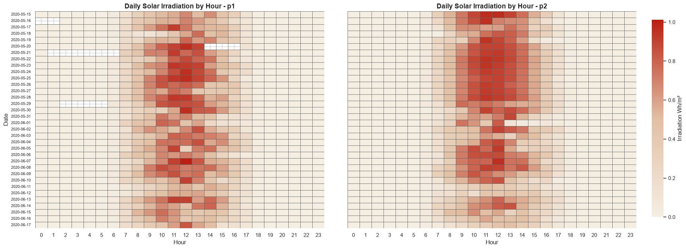
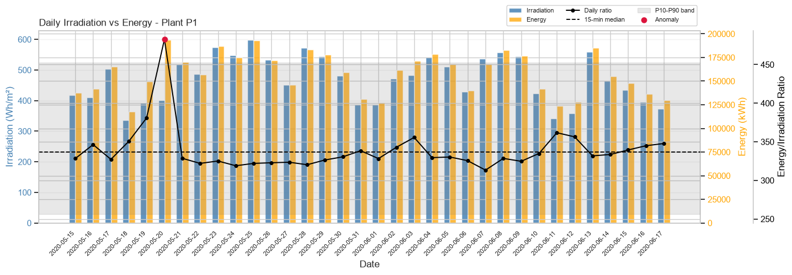
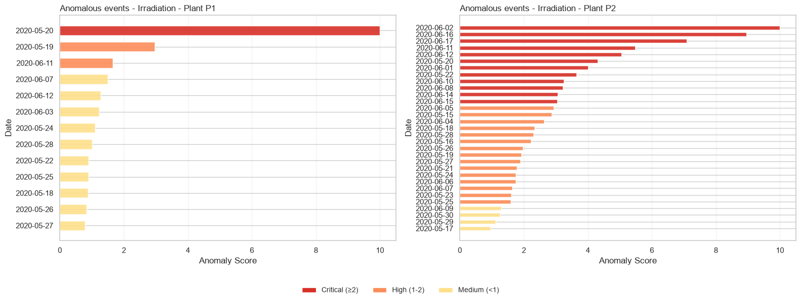
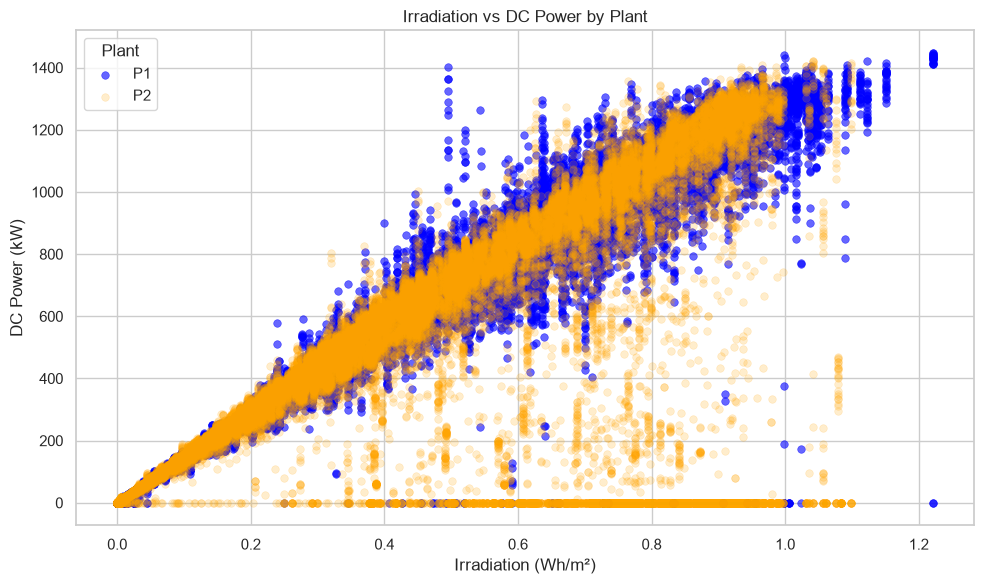
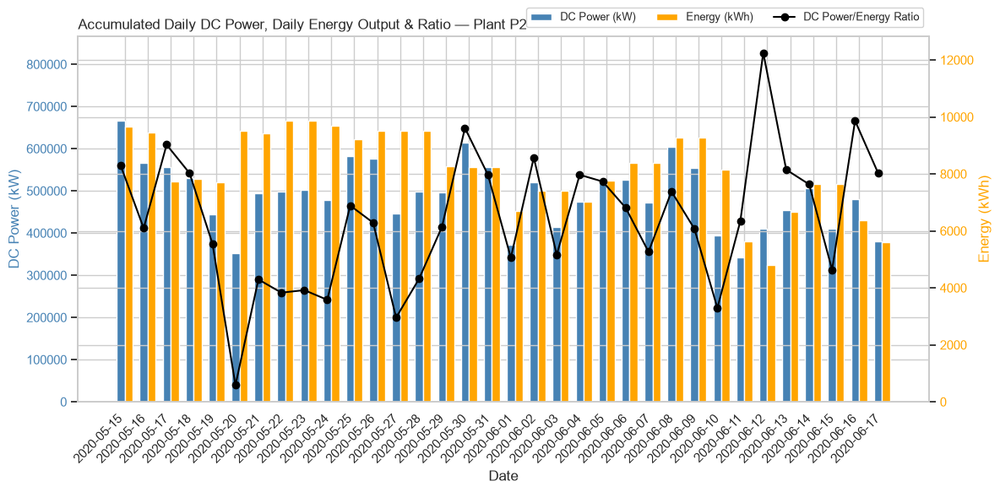
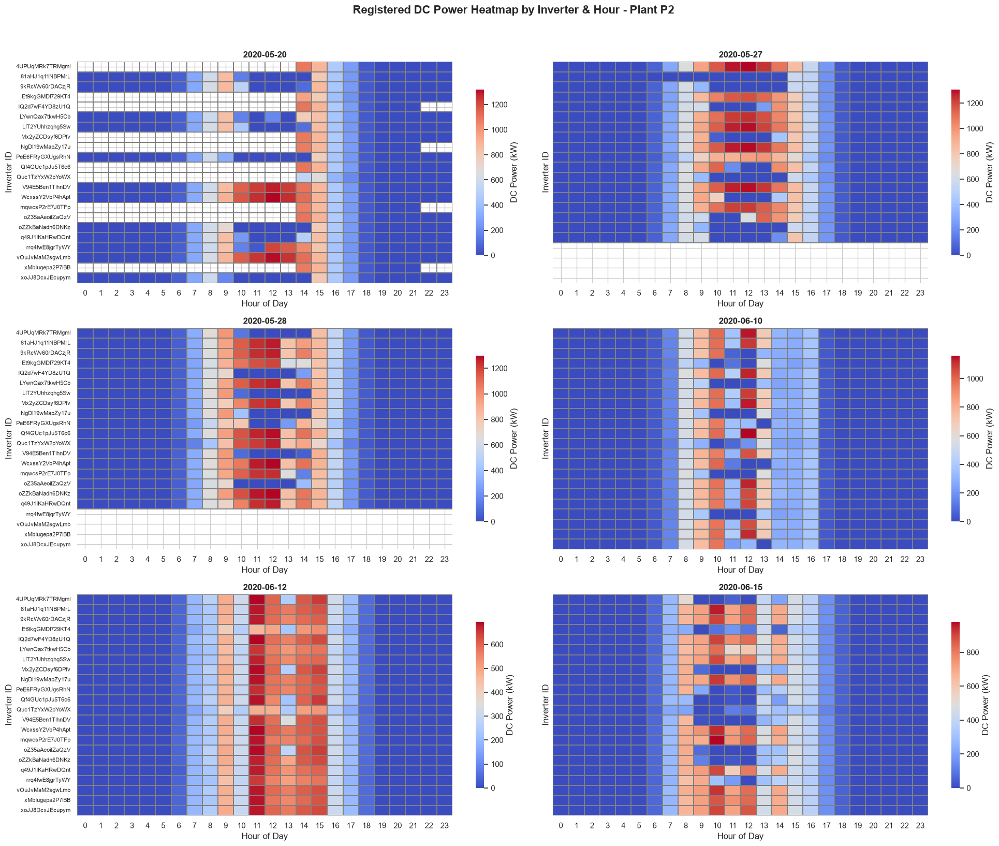

# Solar Power Plant data quality and fault exploratory analysis

## Project overview
This project explores the operational data of two utility-scale solar power plants with the objective of reviewing data quality and identifying potential measurement anomalies.

The analysis follows a structured workflow, starting with data validation and exploratory analysis before progressively investigating sensor faults, inverter measurement issues and potential mismatches.

Although the dataset is publicly available, the complete analysis methodology, feature engineering, anomaly detection criteria and business conclusions were developed independently as part of this portfolio project.


## Business Context
Reliable operational data is essential for monitoring the performance of photovoltaic plants. Missing records, sensor failures or incorrect measurements can lead to inaccurate production estimates, delayed maintenance actions and unaccurate forecasting models.

For this reason, validating data quality is often the first step before a performance analysis, predictive maintenance or energy forecasting.


## Project Objectives
The main objectives of this analysis are:

- Review the overall quality of the available datasets.
- Identify missing records and temporal inconsistencies.
- Detect potential irradiation sensor failures.
- Detect inverter measurement anomalies.
- Prioritize the most critical inverter fault days that would require further inspection.
- Produce a technical report summarizing the main findings.

## Dataset description

### Analyzed Datasets
- Planta1_Generacion.csv: Inverter power generation data.
- Planta2_Generacion.csv: Inverter power generation data.
- Planta1_Sensores.csv: Meteorological and environmental data.
- Planta2_Sensores.csv: Meteorological and environmental data.

### Coverage Period
- Plants: P1, P2.
- Inverters per plant: 22.
- Start date: 15/05/2020.
- End date: 17/06/2020.
- Total duration: 34 days.
- Expected frequency: Measurements every 15 minutes (96 records/day).

## Repository Structure
```text
data/
├── raw/
├── processed/
notebooks/
reports/
├── graphics/
README.md
requirements.txt
```

## Methodology
The analysis was conducted using a progressive investigation approach, where each finding guided the next stage of the analysis.
The workflow consisted of:

1. Review of Data quality.
2. Time series validation.
3. Exploratory data analysis.
4. Correlation analysis.
5. Irradiation sensor validation.
6. Inverter measurement fault detection.
7. Inverter fault severity ranking.
8. Business interpretation of the detected anomalies.


## Analytical Techniques

The project combines several common data analysis techniques, including:

- Exploratory Data Analysis (EDA)
- Time-series analysis
- Feature engineering
- Correlation analysis (Pearson & Spearman)
- Robust statistical metrics (median and IQR)
- Anomaly detection
- Data quality assessment
- Fault severity ranking


## Assumptions & Limitations
Several assumptions were made during the analysis due to the limited contextual information available with the datasets.

- No maintenance logs were available to validate whether anomalies corresponded to actual equipment failures or scheduled shutdowns.
- The installed capacity of each plant was unknown.
- External meteorological data was not available for validation.
- Detected anomalies should therefore be interpreted as potential measurement issues rather than confirmed hardware failures.


## Exploratory Analysis Findings
Each insight presented below builds upon the previous one, following the same investigation process that would typically be carried out during a real exploratory data analysis project.

### Insight 1 - DC Power Scale Mismatch in Plant 1
Plant 1 DC power readings are approximately **10× higher** than Plant 2 values for equivalent conditions. This is likely a **unit error introduced during data collection** rather than a real difference in generation capacity, and should be corrected before any cross-plant comparison.


### Insight 2 - Irregular Time Series Intervals
Both the generation and sensor datasets present **missing 15-minute interval records** across the full observation period. This affects the reliability of any time-based aggregation and should be addressed with interpolation or explicit gap-flagging before modelling.


### Insight 3 - Inverter Record Gaps Detected in Plant 2 (Preliminary)
During initial data exploration, **4 inverters in Plant 2** showed a notable number of missing records. This was flagged for deeper investigation in the EDA phase — see Insight 7 for the full breakdown.


### Insight 4 - Partial and Full Irradiation Data Gaps
Comparative analysis of irradiation capture metrics revealed missing data in both plants:


*Irradiation(Wh/m2) by day and hour — Plant 1 & 2.*

- **Plant 1:** Partial gaps on 2020-05-16, 2020-05-20, 2020-05-21, 2020-05-28, and 2020-05-29.
- **Plant 2:** Partial gaps on 2020-05-20 and 2020-05-29. Complete absence of irradiation data from **2020-05-21 to 2020-05-28**.

DC power generation was recorded during these periods, which points to **irradiation sensor failure** rather than a plant shutdown.


### Insight 5 - Irradiation Sensor Faults Confirmed
The coexistence of degraded irradiation readings alongside normal energy generation confirms the faults originate in the **irradiation measurement equipment**, not in the panels or inverters.


*Daily accumulated irradiation, energy output and ratio — Plant 1.*

*Daily accumulated irradiation, energy output and ratio — Plant 2.*

- **Plant 1:** Irradiation anomalies were detected on May 19 and May 20.
- **Plant 2:** Multiple irradiation measurement anomalies were identified throughout the observation period. The most significant occurred on May 19–20, May 22, June 1–3, June 9–12, and June 16–17.

#### Irradiation sensor faults ranking by Day & Plant


*Daily Irradiation-to-Generation Mismatch Ratio ordered by fault severity.*

**Irradiation Fault Severity Score**:
- To rank irradiation measurement anomalies, a custom severity score was calculated based on the deviation of each day's irradiation-to-energy ratio from the plant's typical behaviour. The ratio was first normalized on a 0–10 scale for each plant. The final score corresponds to the absolute distance from the plant's median normalized ratio.
> **Interpretation:** A score close to **0** indicates normal behaviour, while higher values represent increasingly severe irradiation measurement anomalies.

**Key findings:**
- **23 days classified as severe fault (ratio < 0.059)**, affecting both plants. The worst values were recorded on 2020-05-20 P2 (0.0406), 2020-06-11 P2 (0.0441), and 2020-05-20 P1 (0.0441).
- **8 days classified as minor fault (0.059–0.061):** June 11 P1, June 12 both plants, June 3 P1, May 18 both plants, May 17 P2, June 17 P1.
- **Plant 2 is significantly more affected**, with 6 severe-fault days exclusive to P2 concentrated in late May and early June (May 21–29, June 1, 3, 10, 11, 15–17).
- **Plant 1** shows a more contained pattern, with severe faults mainly on May 19–20 and isolated days in June.
- No single day across the full 34-day window reached a normal ratio in either plant, pointing to a **persistent and systemic sensor degradation** rather than isolated failures.

### Insight 6 - Irradiation vs DC Power mismatch confirmed. DC/AC Power transformation has perfect correlation.
DC Power mismatch with Irradiation, specifically in plant 2. A deeper analysis will be required to identify specific inverter faults for every mismatch.


*Irradiation vs DC Power in both plants showing a severe mismatch in Plant 2 registered values.*

#### Pearson and Spearman DC/AC Power transformation correlation check
Previous registered anomalies have been collected and evaluated to find mismatch in between DC/AC Power transformation.
**Anomaly filtering:** Irradiation threshold = 0.2. DC Power threshhold = 50.
- **Pearson correlation:** 1.000
- **Spearman correlation:** 1.000

This confirms the **absence of anomalies** with DC/AC Power transformation.


### Insight 7 - Inverters DC/AC measurement failures detected in both plants
Although no anomalies have been detected in the inverters’ conversion of DC to AC power, numerous measurement errors have been identified that affect both DC and AC equally.
**This specific analysis will focus on Plant 2**, as it has by far the most measurement errors. T
Subsequently, the inverter measurements on the most anomalous days were analyzed to determine the possible types of errors encountered.


*Daily DC Power vs Acc. energy in plant 2. The black line shows the daily ratio of energy generated to cumulative power, using the black dotted line as a reference; this referene ratio was calculated using the median of the ratios for all recorded days to avoid outliers.*

- The graph clearly shows the **lack of correlation between DC power and energy generated** at Plant 2. Most critical days are: May 20th, May 27th, May 29th, 10th to 11th June and 15th June.

#### Inverter measurement faults study (most critical days)
The following graphs clearly show multiple measurement errors of various types at Plant 2. Due to the scope of this project, not every day has been analyzed in detail; only the most representative days have been selected as examples.


*Severe DC Power measurement faults detected in plant 2. Failures range from isolated measurement outages to simultaneous outages of all measurement sensors.*
- A separate study would be needed for each day and inverter, conducted in collaboration with technicians from the solar photovoltaic plant itself, to determine the exact cause of the measurement errors or whether, on the contrary, they were caused by inverters being shut down; since there is a lack of correlation between irradiance and DC power, this suggests that in some cases an inverter may have been shut down for maintenance.

#### Inverter Fault Ranking & Priority Review List

**Methodology:**
Two fault types were detected and scored independently:
- **Record absence:** inverter with <50% of the median daily records during solar hours (06:00–20:00) → weighted ×5 in final score.
- **Anomalous zero-power readings:** inverter power <5% of the hourly median while the plant median exceeded 100 kW.

`Score = anomalous_hours + (absence_days × 5)`


*Inverter fault priority ranking based on anomalous hours and absence days.*

- Plant 1 shows **isolated and low-severity faults**. Only 2 inverters require urgent attention.
- Plant 2 presents a **critical situation**: 17 out of 22 inverters show high-severity anomalies persisting across most of the 34-day period. Top inverters (`Et9kgGMDl729KT4`, `LYwnQax7tkwH5Cb`, `Quc1TzYxW2pYoWX`) recorded anomalous readings on **24–28 out of 34 days**. The scale and consistency of these faults indicates a **systemic measurement problem** beyond individual inverter failures.


## Recommendations
Based on the findings, the following actions are recommended:

- Inspect the irradiation sensors, particularly in Plant 2.
- Review the calibration and data acquisition systems.
- Validate the reported DC power measurements for the most affected inverters.
- Implement automatic monitoring rules to detect future measurement anomalies.
- Verify the detected events against maintenance logs before taking operational decisions.

## Future Work
Possible extensions of this project include:

- Predictive maintenance models.
- Automated anomaly detection.
- Energy production forecasting.
- Long-term inverter reliability analysis.
- Integration with maintenance and weather data.


## Summary
The analysis revealed that the main issues affecting these datasets are related to data quality rather than energy production itself.

The investigation identified widespread irradiation sensor failures, multiple inverter measurement anomalies and several inconsistencies that would significantly impact any downstream predictive modelling if left unaddressed.

Overall, Plant 2 presents considerably poorer data quality than Plant 1 and should be prioritised for further technical inspection before the data is used for performance monitoring or machine learning applications.